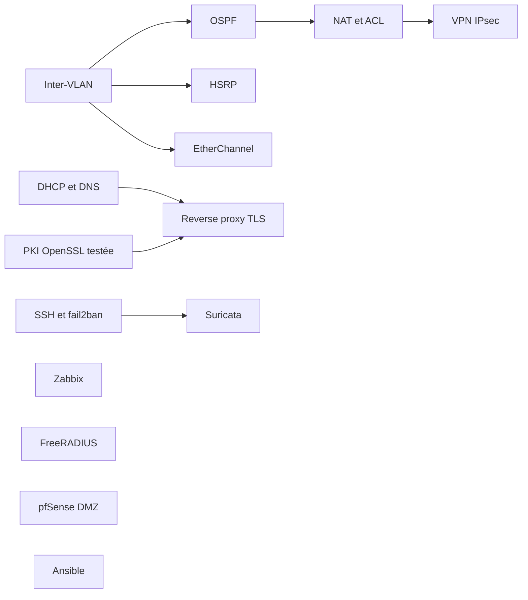

# Feuille de route réseau (BTS SIO SISR)

Le point d'entrée de mes projets réseau et systèmes : **ce qui est réalisé, ce qui est testé, ce que je prépare, et les projets libres que je vais pratiquer**. Chaque ligne indique son **statut réel**, pour ne pas confondre un projet terminé avec un guide encore à faire.

| Statut | Signification |
|---|---|
| **Réalisé** | mis en œuvre et documenté (voir le dépôt) |
| **Testé** | outil ou guide avec des tests automatiques qui passent, rejoués à chaque `push` quand une CI est indiquée |
| **À réaliser** | guide préparé, **pas encore rejoué de bout en bout** ; un journal en bas de page sera rempli avec mes résultats |
| **Fork à pratiquer** | projet d'une autre personne, copié tel quel (fork) pour m'entraîner ; ce n'est **pas mon code** |

## 1. Réalisé

| Projet | Contenu |
|---|---|
| [labs-reseau-cisco](https://github.com/mehdiseg/labs-reseau-cisco) | TP de commutation Packet Tracer : VLAN, trunks 802.1Q, port-security, SSH, Spanning Tree |
| [serveur-debian-lemp-securise](https://github.com/mehdiseg/serveur-debian-lemp-securise) | Serveur Debian 13 : nginx, MariaDB, PHP-FPM, pare-feu UFW (SSH seulement) |
| [scanner-reseau-powershell](https://github.com/mehdiseg/scanner-reseau-powershell) | Scanner de réseau local en PowerShell (36 vérifications automatiques) |
| [santas-workshop](https://github.com/mehdiseg/santas-workshop) | Application web de suivi de production de cadeaux, avec correction d'une faille XSS |
| [techshop](https://github.com/mehdiseg/techshop) | Refonte d'un site e-commerce (HTML, CSS, JavaScript) |
| [mehdiseg.github.io](https://github.com/mehdiseg/mehdiseg.github.io) | Mon portfolio BTS SIO |
| noha-auto (dépôt privé) | Serveur de catalogue et de stock d'un magasin, comptes et HTTPS ; le code est présenté sur demande |

## 2. Outils testés

| Dépôt | Ce que c'est | Tests |
|---|---|---|
| [calculateur-sous-reseaux](https://github.com/mehdiseg/calculateur-sous-reseaux) | Informations d'un réseau, découpage égal et VLSM | 14 tests, CI |
| [tp-wireshark-analyse-trafic](https://github.com/mehdiseg/tp-wireshark-analyse-trafic) | Capture synthétique et 18 exercices de filtres Wireshark | chaque réponse vérifiée avec `tshark`, CI |
| [wireguard-generateur-config](https://github.com/mehdiseg/wireguard-generateur-config) | Configuration WireGuard serveur et clients | 16 tests avec le vrai `wg`, CI |
| [pki-interne-openssl](https://github.com/mehdiseg/pki-interne-openssl) | Autorité de certification interne et certificats avec SAN | 27 vérifications dont une vraie connexion TLS, CI |
| [nmap-audit-reseau-local](https://github.com/mehdiseg/nmap-audit-reseau-local) | Mémo Nmap, banc d'essai local, comparaison de scans | 16 tests, CI |
| [homelab-docker-services](https://github.com/mehdiseg/homelab-docker-services) | Uptime Kuma, Nginx Proxy Manager et Pi-hole avec Docker Compose | syntaxe validée (`docker compose config`), CI ; **pas déployé** |
| [plex-serveur-multimedia](https://github.com/mehdiseg/plex-serveur-multimedia) | Guide et Docker Compose pour un serveur Plex | syntaxe validée, CI ; **guide générique** |
| [tailscale-funnel-serveur-maison](https://github.com/mehdiseg/tailscale-funnel-serveur-maison) | Retour d'expérience : publier une application chez soi en HTTPS | état vérifié sur mon PC ; un point reste **non vérifié** (voir le dépôt) |

## 3. Labs à réaliser

Guides préparés, avec configurations complètes, vérifications et pièges fréquents. Ordre de travail conseillé, avec les prérequis :

| Lab | Outils | Statut |
|---|---|---|
| [lab-cisco-inter-vlan-router-on-a-stick](https://github.com/mehdiseg/lab-cisco-inter-vlan-router-on-a-stick) | Packet Tracer | À réaliser |
| [lab-cisco-ospf-multi-routeurs](https://github.com/mehdiseg/lab-cisco-ospf-multi-routeurs) | Packet Tracer | À réaliser |
| [lab-cisco-nat-pat-acl](https://github.com/mehdiseg/lab-cisco-nat-pat-acl) | Packet Tracer | À réaliser |
| [lab-cisco-hsrp-redondance](https://github.com/mehdiseg/lab-cisco-hsrp-redondance) | Packet Tracer | À réaliser |
| [lab-cisco-etherchannel-lacp](https://github.com/mehdiseg/lab-cisco-etherchannel-lacp) | Packet Tracer | À réaliser |
| [lab-cisco-vpn-ipsec-site-a-site](https://github.com/mehdiseg/lab-cisco-vpn-ipsec-site-a-site) | Packet Tracer (licence securityk9) | À réaliser |
| [lab-dhcp-dns-debian](https://github.com/mehdiseg/lab-dhcp-dns-debian) | Debian, Kea, BIND 9 | À réaliser |
| [lab-nginx-reverse-proxy-tls](https://github.com/mehdiseg/lab-nginx-reverse-proxy-tls) | Debian, nginx, PKI interne | À réaliser |
| [lab-fail2ban-ssh-durcissement](https://github.com/mehdiseg/lab-fail2ban-ssh-durcissement) | Debian, sshd, fail2ban | À réaliser |
| [lab-suricata-ids-detection](https://github.com/mehdiseg/lab-suricata-ids-detection) | Debian, Suricata, Nmap | À réaliser |
| [lab-supervision-zabbix](https://github.com/mehdiseg/lab-supervision-zabbix) | Debian, Zabbix, SNMP | À réaliser |
| [lab-freeradius-authentification](https://github.com/mehdiseg/lab-freeradius-authentification) | Debian, FreeRADIUS, switch Cisco | À réaliser |
| [lab-pfsense-dmz-vlans](https://github.com/mehdiseg/lab-pfsense-dmz-vlans) | VirtualBox, pfSense | À réaliser |
| [lab-ansible-automatisation-reseau](https://github.com/mehdiseg/lab-ansible-automatisation-reseau) | Ansible, équipement Cisco en SSH | À réaliser |

## 4. Projets d'autres personnes à pratiquer

Forks de projets libres liés au réseau, conservés **intacts** (auteurs, historique et licence d'origine). Je les explorerai un à un ; ce n'est pas mon travail.

| Projet (fork) | Licence | Ce que j'en ferai |
|---|---|---|
| [CCNA-Labs](https://github.com/mehdiseg/CCNA-Labs) | MIT | refaire les labs Packet Tracer dans l'ordre |
| [Network-Simulation-Using-Cisco-Packet-Tracer](https://github.com/mehdiseg/Network-Simulation-Using-Cisco-Packet-Tracer) | MIT | reconstruire la simulation d'un réseau de trois entreprises |
| [cisco-cheatsheet](https://github.com/mehdiseg/cisco-cheatsheet) | GPL-3.0 | aide-mémoire de commandes IOS |
| [netmiko](https://github.com/mehdiseg/netmiko) | MIT | automatiser des équipements en Python, à comparer avec Ansible |
| [containerlab](https://github.com/mehdiseg/containerlab) | BSD-3-Clause | labs réseau en conteneurs, sans matériel |
| [scapy](https://github.com/mehdiseg/scapy) | GPL-2.0 | fabriquer et analyser des paquets, prolongement du TP Wireshark |
| [termshark](https://github.com/mehdiseg/termshark) | MIT | analyser des captures depuis un terminal |
| [WatchYourLAN](https://github.com/mehdiseg/WatchYourLAN) | MIT | surveiller un réseau, à comparer avec mon scanner PowerShell |
| [headscale](https://github.com/mehdiseg/headscale) | BSD-3-Clause | serveur de contrôle Tailscale auto-hébergé |
| [wireguard-install](https://github.com/mehdiseg/wireguard-install) | MIT | lire le script pour comprendre l'installation de WireGuard |
| [wireguard-docs](https://github.com/mehdiseg/wireguard-docs) | MIT | documentation détaillée de WireGuard |

## Transparence

Une partie de ce compte a été rédigée **avec l'aide de l'assistant IA Claude** (Anthropic) : tous les outils et labs des sections 2 et 3, le scanner PowerShell, l'application Noha Auto et les README de plusieurs autres dépôts. Les commits créés avec lui portent la mention `Co-Authored-By`. Mes TP de cours, mes projets de formation et mon portfolio sont mes propres travaux.

Je m'appuie sur ce qui a pu être **vérifié** : les outils marqués « Testé » ont des tests qui passent, et les guides « À réaliser » le disent clairement. Un lab ne passe en « Réalisé » qu'une fois refait par mes soins, avec captures et journal remplis.

## Licence

[MIT](LICENSE) pour les contenus de ce dépôt. Les projets forkés gardent leur licence d'origine.
